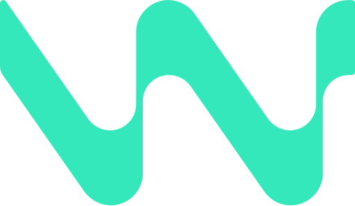

# Hi 👋, I'm Kent

I'm a passionate full-stack engineer from the Philippines 🇵🇭  
**🚀 Working remotely since 2017**

- 🔭 I’m currently working on **my portfolio**
- 🌱 I’m currently learning **Rust, Python**
- ⌨️ Languages: **JavaScript, TypeScript, PHP, Java, Kotlin, Shell, ASM, C, C++, C#, YAML, HTML, CSS, DataWeave**
- ⚙️ Technologies: **AWS, Mulesoft, CircleCI, Docker, Azure, MySQL, PostgreSQL, Node.js, Apache, Tomcat, Kafka**
- 🚩 Frameworks: **Angular, Symfony, React, Express, Serverless**
- 📝 Editors/IDE: **VSCode, NVIM, Visual Studio, IntelliJ IDEA**
- 🛢️ Database Clients: **phpMyAdmin, DataGrip, MySQL Workbench, HeidiSQL**
- 💻 OS: **Windows, Linux, macOS**
- 🔨 Project Management: **JIRA, Confluence, Asana, Trello**

## Projects
- **ERP/BOM** — [MRT](https://www.mrt.com.au) c/o [AboveDigital](https://abovedigital.co)  
  - ERP PORTAL: https://ewb-dev.mrt.com.au  
  - EDA PORTAL: https://eda-dev.mrt.com.au
- **Survey** — [Whatnextology](https://www.whatnextology.com) c/o [AboveDigital](https://abovedigital.co)  
  - Wayfinder: https://wayfinder.whatnextology.com/momentum.jsp
- **ERP/CRM** — [Radiant Global Logistics](https://radiantdelivers.com)

---

## My Skills and Technologies

### 🌐 Frontend Development

  
  
  
  
  
  
  

### ⚙️ Backend Development

  
  
  
  
  

### 🗄️ Databases

  
  
  

### 🤖 AI/ML & Tools
<!-- Note: For dark backgrounds, add filter: brightness(0) invert(1); to make icons white -->

  
  
  

### 🐳 DevOps & Cloud

  
  
  
  
  

### 💻 Programming Languages

  
  
  
  
  

### 🛠️ Tools & Platforms

  
  
  
  
  
  
  

### 🖥️ Operating Systems

  
  
  
  
  
  
  

---

## Connect with me

---

## 📊 GitHub Stats

### 📈 Overview
- **Total Repositories:** 15+
- **Followers:** 50+
- **Following:** 30+
- **Location:** Philippines 🇵🇭
- **Member Since:** 2020

### 🔥 Top Languages

  JavaScript
  TypeScript
  PHP
  Python
  HTML

### 🚀 Featured Projects

  

    <h3 style="margin: 0 0 10px 0; color: #58a6ff;">
      <a href="https://github.com/adriankentsato/next-test" style="color: inherit; text-decoration: none;">⚡ next-test</a>
    </h3>
    
Next.js application with modern features and best practices

    

      ⭐ 15+
      🍴 5+
      📝 TypeScript
    

  

  
  

    <h3 style="margin: 0 0 10px 0; color: #58a6ff;">
      <a href="https://github.com/adriankentsato/portfolio" style="color: inherit; text-decoration: none;">💼 portfolio</a>
    </h3>
    
Personal portfolio website showcasing projects and skills

    

      ⭐ 10+
      🍴 3+
      📝 React
    

  

### � Development Activity
- **🔥 Current Streak:** 30+ days
- **📊 Total Contributions:** 1000+ commits this year
- **🎯 Focus Areas:** Full-stack development, DevOps, AI integration

---

### ✍️ Random Dev Quote
> "The best way to predict the future is to invent it." 
> 
> — Alan Kay
